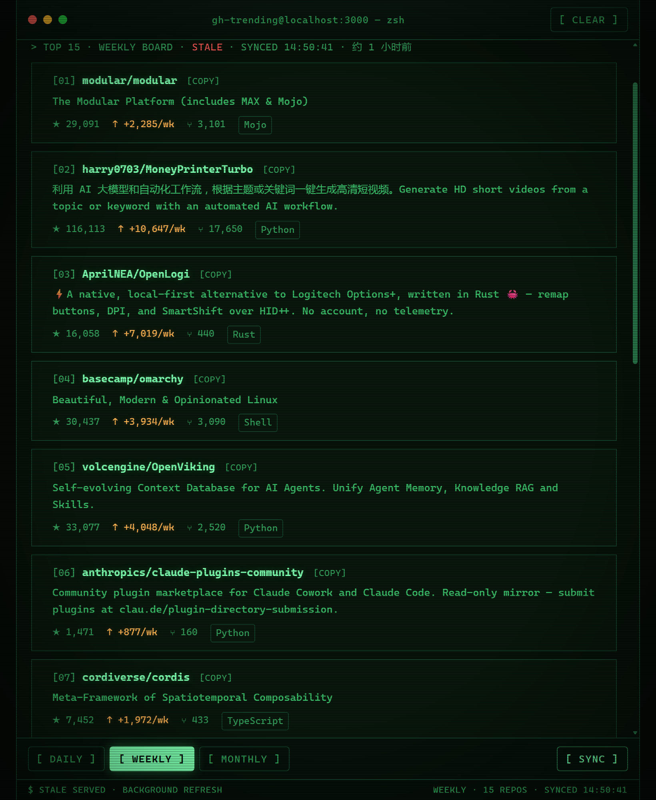

# GitHub 热门 · 复古终端（GH-TRENDING // TERMINAL）

一个极简的网页应用：以复古终端 / 黑客风的 CRT 界面，一键同步 GitHub 官方 Trending 的日榜 / 周榜 / 月榜。

  



## 宣传视频

- [英文版 Promo（36s / 1080p）](https://github.com/q93304989-bit/github-trending-chat/releases/download/v1.0.0/github-trending-chat-en.mp4)
- [中文版宣传片（36s / 1080p）](https://github.com/q93304989-bit/github-trending-chat/releases/download/v1.0.0/github-trending-chat-cn.mp4)

## 功能特性

- **三榜切换**：日榜 / 周榜 / 月榜一键切换（`since=daily|weekly|monthly`），非法参数自动回退周榜
- **自动加载**：打开页面即自动同步；再次打开秒显上次数据（localStorage 兜底），后台静默刷新
- **离线兜底**：前端 15s 超时 + 错误气泡内一键重试；后端拉取失败时返回过期缓存（标注 `STALE`），而不是白屏报错
- **弱网友好（三级缓存）**：浏览器 ETag/304 与静态资源缓存 → 服务端内存缓存 + 过期即时回旧数据后台刷新（SWR）→ 前端 localStorage 离线兜底；详见下文「缓存与弱网策略」
- **聊天卡片展示**：排名、仓库名直达链接、简介、语言、总星标、周期新增星标、fork 数一目了然
- **[COPY] 一键复制**仓库地址；键盘快捷键 `1` / `2` / `3` 切换榜单、`R` 立即同步
- **CRT 视觉**：磷光绿配色、扫描线、辉光与闪烁动画（遵循 `prefers-reduced-motion`）、焦点可见样式、内联 favicon
- **一键启动**：Windows 下双击 `一键启动.vbs`，脚本轮询端口就绪后才打开浏览器，失败弹窗提示
- **零依赖**：仅使用 Node.js 内置模块，无需 `npm install`

## 快速开始

需要 Node.js 18+（Node 23 已测试）。

```bash
node server.js
```

打开 http://localhost:3000，页面会自动同步周榜。

Windows 用户也可以直接双击项目根目录的 `一键启动.vbs`：后台启动服务、等端口就绪后自动打开浏览器；若端口被占用或启动失败会弹窗说明。

可用环境变量：

| 变量 | 默认 | 说明 |
|------|------|------|
| `PORT` | `3000` | 监听端口；被占用时会给出友好提示而非堆栈报错 |
| `TRENDING_TTL_MS` | `60000` | 上游数据缓存时长（毫秒），设为 `0` 可每次强制回源 |

## 使用说明

1. 打开页面：终端完成开机自检后自动同步当前榜单（首次为周榜）。
2. 底部命令栏点 `[ DAILY ] / [ WEEKLY ] / [ MONTHLY ]`，或按数字键 `1/2/3` 切换日/周/月榜。
3. 按 `R` 或点 `[ SYNC ]` 强制重新同步；`[ CLEAR ]` 清空屏幕缓冲。
4. 点仓库名直达 GitHub 仓库；点卡片上的 `[COPY]` 复制仓库地址。
5. 断网或超时：已看过的数据保持可见，状态栏提示 `REFRESH FAILED · SHOWING CACHED DATA`；错误气泡内置 `[ RETRY ]`。
6. 数据新鲜度见状态栏：`WEEKLY · 11 REPOS · SYNCED 17:52:46`，来源标记 `LIVE / CACHE / STALE`。

## 缓存与弱网策略

针对 GitHub 访问不稳定的环境做了三层递进，任何一层命中都不会让用户干等：

| 层 | 机制 | 效果 |
|----|------|------|
| 浏览器 | API 响应带 `ETag` + `Cache-Control: no-cache`，内容未变时返回 `304`（仅 ~200B）；HTML 自身 `no-cache`，JS/CSS 带 `?v=` 内容指纹长缓存（1h） | 发版即生效，回访近乎零流量 |
| 服务端 | 每榜单 60s 新鲜期内直接回内存；**过期后不再阻塞等待 GitHub——立即回旧数据（标注 `STALE`）并触发后台刷新**；并发请求 single-flight 合并；上游瞬断自动重试 1 次；持续故障按 30s→60s→…指数冷却（上限 5min），冷却期内只回缓存不打扰上游 | 弱网下同步永远 <10ms，新数据稍后自动就位，GitHub 宕机也不形成重试风暴 |
| 前端 | 成功结果写 `localStorage`，下次打开秒显上次数据再后台静默刷新；失败保持现有画面，状态栏提示 `REFRESH FAILED · SHOWING CACHED DATA` | 断网也能完整使用 |

数据年龄透明化：非实时数据在头部显示 `SYNCED 17:52:46 · 约 5 分钟前`。

## 项目结构

```
server.js          # HTTP 服务 + 多榜单缓存(single-flight/stale 兜底) + 静态文件
lib/parser.js      # Trending 页面 HTML 解析（兼容 today / this week / this month）
public/
  index.html       # 终端窗口骨架（标题栏/滚动区/命令栏/状态栏）
  style.css        # CRT 磷光绿主题（扫描线/辉光/闪烁/焦点样式）
  app.js           # 自动加载、本地兜底、榜单切换、快捷键、重试
  render.js        # 仓库卡片渲染（UMD，可单测）
  demo.js          # 宣传截图专用演示模式（#/demo/cards|loading[/tall]），日常使用不激活
test/              # 单元与集成测试（30 个，含 FIXLIST 回归）
一键启动.vbs       # Windows 一键启动（端口就绪轮询 + 失败弹窗）
docs/screenshot.png # 界面预览图
```

## 测试

```bash
node --test
```

## 数据说明

- 数据来源：`https://github.com/trending?since=daily|weekly|monthly`
- 各周期页面把新增星标分别显示为 `stars today / this week / this month`，解析器统一归一化到字段 `weeklyStars`（含义=所选周期的新增星标），前端按周期渲染为 `/day · /wk · /mo`
- 解析规则针对真实页面结构：仓库名取自 `<h2>` 链接，星标数取自 SVG 图标后的裸文本

## 技术栈

- Node.js（内置 `http` + `fetch` + `AbortSignal.timeout`）
- 原生 HTML / CSS / JavaScript（无构建步骤）
- `node:test` 测试框架